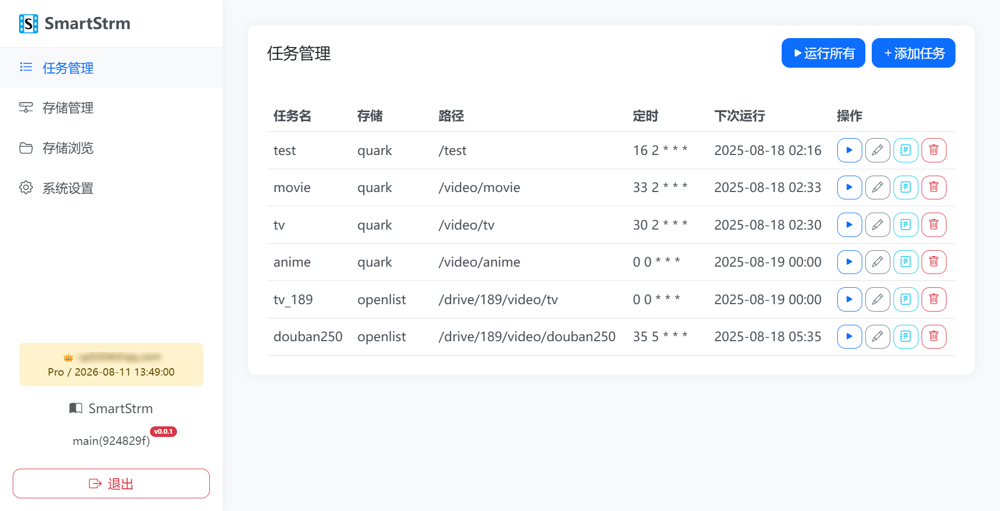
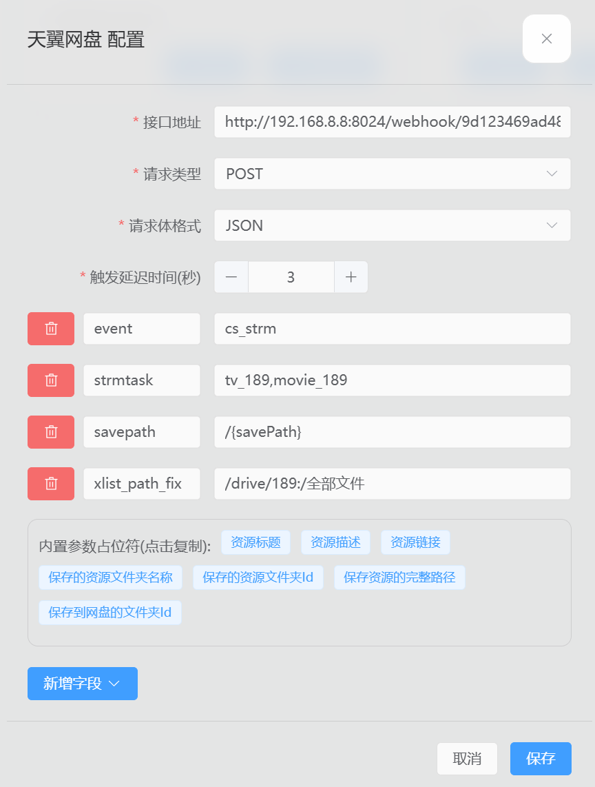
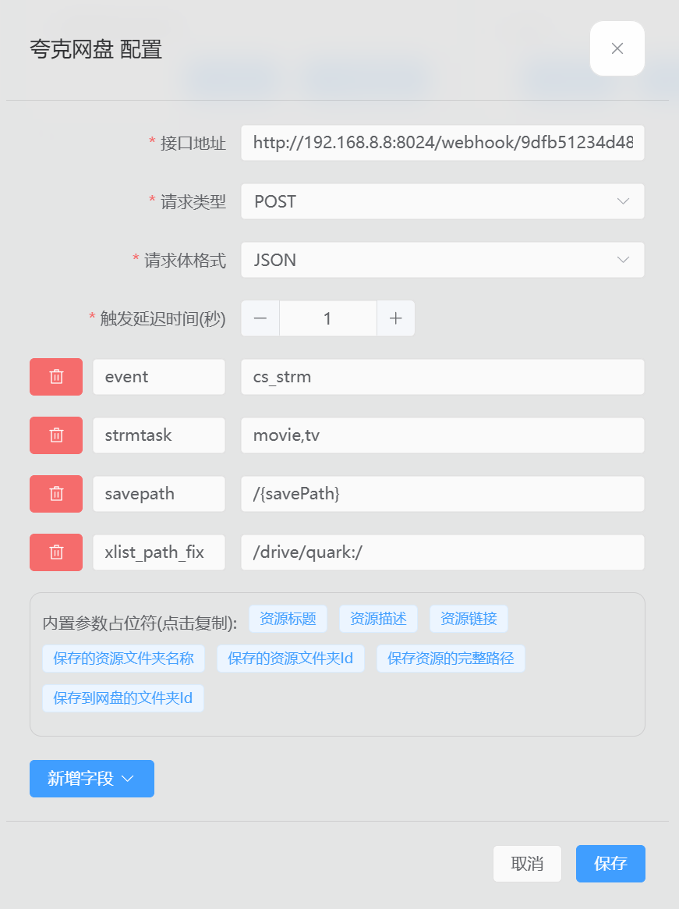

<div align="center">


# SmartStrm

一个媒体库 STRM 文件生成工具。

和 Emby 优雅配合，支持 302 直链播放，支持同步删除远端文件。

正如其名，配合 quark-auto-save/CloudSaver, OpenList, Emby 力求即存即看。🥳

[![releases][releases-image]][docker-url] [![docker pulls][docker-pulls-image]][docker-url] [![docker image size][docker-image-size-image]][docker-url] [![telegram][telegram-image]][telegram-url]

[telegram-image]: https://img.shields.io/badge/Telegram-2CA5E0?logo=telegram&logoColor=white
[releases-image]: https://img.shields.io/docker/v/cp0204/smartstrm
[docker-pulls-image]: https://img.shields.io/docker/pulls/cp0204/smartstrm?logo=docker&&logoColor=white
[docker-image-size-image]: https://img.shields.io/docker/image-size/cp0204/smartstrm?logo=docker&&logoColor=white
[github-url]: https://github.com/Cp0204/smartstrm
[docker-url]: https://hub.docker.com/r/cp0204/smartstrm
[telegram-url]: https://t.me/smartstrm



</div>

## 特性

- 支持 OpenList、WebDAV、Quark 等网络驱动
- 任务管理
  - 基于 Crontab 的定时任务
  - 单个任务独立日志
  - 任务工具箱：内容替换、一键清理
- STRM 生成
  - 目录时间检查
  - 增量/同步生成：可清理远端已删文件
  - 指定生成的媒体后缀、文件大小阈值
  - 指定复制的文件后缀
- Webhook
  - 联动 QAS、CloudSaver 等转存工具触发任务
  - Emby 删除媒体同步删除远端文件
- 粗糙但极其友好的管理页面
  - 存储浏览、批量重命名
  - 任务日志查看
- 一站式 Emby Jellyfin 302 直链播放 (Pro)

## 部署

部署命令

```bash
docker run -d \
  --name smartstrm \
  --restart unless-stopped \
  --network host \
  -v /yourpath/smartstrm/config:/app/config \  # 挂载配置目录
  -v /yourpath/smartstrm/logs:/app/logs \  # 挂载日志目录，可选
  -v /yourpath/smartstrm/strm:/strm \  # 挂载 STRM 生成目录
  -e PORT=8024 \  # 管理端口，可选
  -e ADMIN_USERNAME=admin \  # 管理用户名
  -e ADMIN_PASSWORD=admin123 \  # 管理用户密码
  -e LICENSE= \  # 许可证字符串（如有）
  cp0204/smartstrm:latest
```

docker-compose.yml

```yaml
name: smartstrm
services:
  smartstrm:
    image: cp0204/smartstrm:latest
    container_name: smartstrm
    restart: unless-stopped
    network_mode: host
    volumes:
      - /yourpath/smartstrm/config:/app/config # 挂载配置目录
      - /yourpath/smartstrm/logs:/app/logs # 挂载日志目录，可选
      - /yourpath/smartstrm/strm:/strm # 挂载 STRM 生成目录
    environment:
      - PORT=8024 # 管理端口，可选
      - ADMIN_USERNAME=admin # 管理用户名
      - ADMIN_PASSWORD=admin123 # 管理用户密码
      - LICENSE= # 许可证字符串（如有）
```


## 使用

**原理：** [STRM 文件](https://emby.media/support/articles/Strm-Files.html) 是一个网络资源的快捷方式，它使得无须在本地存储媒体文件，让 Emby 直接从网络上播放媒体文件，因扫描媒体库只识别文件名，而不用读取媒体文件内容，所以入库极快。支持 STRM 文件的有 Emby, Jellyfin, Kodi 等。

### SmartStrm 的使用步骤：

1. 添加存储
2. 添加任务，生成 STRM 文件
3. 挂载 STRM 目录给媒体库容器的 /strm 路径
4. 扫描媒体库，识别 STRM 文件

完成以上步骤，Emby 已经能够直接从网盘直接提供播放，此时所有视频流量经过 Emby ，如果你在局域网外访问，可能受限于家中网络的上传带宽（特别是多人同时播放时）。你可能还需要：

5. 设置302代理服务器（Pro），改从 SmartStrm 提供的端口访问 Emby ，将直接从网盘获取视频流（需网盘支持），享受最顺畅的播放。

## 进阶使用

### 转存自动生成STRM

支持和 `quark-auto-save` `CloudSaver` 联动，在转存后触发任务。支持**仅触发转存的那一个文件夹，秒级生成**。

#### quark-auto-save 插件

- **webhook**: SmartStrm Webhook 地址，从 `系统设置 - Webhook` 中获取
- **strmtask**: 相关的 SmartStrm 任务名，支持多个如 `tv,movie`
- **xlist_path_fix**: 路径映射， SmartStrm 任务使用 夸克网盘 驱动时无须填写；使用 OpenList 驱动时需填写如 `/storage_mount_path:/quark_root_dir` 的格式 ，例如把夸克根目录(/)挂载在 OpenList 的 /quark 下，则填写 `/quark:/`。**SmartStrm 会使 OpenList 强制刷新目录，无需再用 alist 插件刷新。**

#### CloudSaver 扩展

基本和 QAS 参数逻辑相同，但需增加 `event` `savepath` 和调整 `xlist_path_fix` 参数。


- **webhook**: 同QAS
- **strmtask**: 同QAS
- **event**: `cs_strm`
- **savepath**: `/{savePath}`
- **xlist_path_fix**: 使用 OpenList 驱动时需填写。夸克网盘同QAS，天翼云盘 `/你挂载在oplist的路径:/全部文件` ，只改动 : 前面部分，后面 /全部文件 保持不变。

<details>
<summary>天翼网盘配置示例图</summary>



</details>

<details>
<summary>夸克网盘配置示例图</summary>



</details>


### Emby 删除同步

> 需把 STRM 目录挂载到 Emby 容器的 /strm 路径下

在 `SmartStrm - Webhook - Emby 删除同步设置` 中启用功能，默认关闭。

在 `Emby - 后台管理 - 通知` 中设置：

- **网址**： SmartStrm Webhook 地址
- **请求内容类型**: application/json
- **Events**: 勾选 `媒体库-媒体删除`

## 302 代理

> 使用 SmartStrm 提供的 302 代理，将 Emby 客户端播放请求重定向，直接从直链获取视频流，不受 Emby 服务器的带宽限制。
>
> 测试支持绝大多数提供 http 直链的网盘，如使用 OpenList - 天翼 方案较为完美。
>
> 图标示意: ✅兼容 ❌不兼容 🟡部分兼容 ⚫未测试

### 按驱动分

| 驱动        | Emby 302 | Jellyfin 302 | 备注                                                  |
| ----------- | -------- | ------------ | ----------------------------------------------------- |
| OpenList    | ✅        | ✅            | 如果 oplist 开启302，直链兼容性依赖于网盘能否提供直链 |
| 夸克网盘    | 🟡        | 🟡            | 默认使用转码直链，部分视频不兼容，可用智能回落到代理  |
| 115开放平台 | ✅        | ✅            | 直链完美兼容；但普通用户API限速，频繁报错             |

### 按客户端分

| 客户端     | Emby | Jellyfin | 备注                             |
| ---------- | ---- | -------- | -------------------------------- |
| Web        | 🟡    | 🟡        | 不兼容夸克部分转码资源，其他正常 |
| Android    | ✅    | ⚫        |                                  |
| Android TV | 🟡    | -        | 不兼容夸克部分转码资源，其他正常 |
| VidHub     | ✅    | ✅        |                                  |
| Yamby      | 🟡    | -        | 不兼容夸克部分转码资源，其他正常 |
| AfuseKt    | ✅    | ✅        |                                  |

## Q&A

#### Q: 是否支持网盘转存、自动转存？
> A: 暂无计划，做好一件事，少即是多。市面上已经有不少转存工具，不重复造轮子，除非我有信心做成最好用的轮子。

#### Q: 免费和收费？
> A: 基础功能免费（STRM生成，Webhook），已经能够满足绝大多数人需求，高级功能付费（302代理），定价极其合理。

#### Q: 302代理之后可以分享给家人和朋友用吗 这样会风控吗？
> A: 代理后直接由客户端向网盘请求下载，能识别到多IP、多UA用你的账号在请求下载。我觉得看程度吧，三五人都问题不大，假设我就是家里登录了、公司在异地也登录了，属于正常使用需求。但你要是公开出去同时十几、几十处异地下载，只能说有风险，风险自担。

#### Q: 关于目录时间检查选项的工作机制？
> A: 这个选项是为了最小化地请求接口，和最快的速度完成任务。远端目录的修改时间就更新了，比本地新，就会往下检查。已知115新增/删除文件都会更新父目录的修改时间；夸克网盘新增会更新但删除不会；各个盘可能机制不一，需要自行测试。

#### Q: 映射了 302 代理端口访问 Emby ，还要不要映射 SmartStrm 端口？
>A: 不需要，如果用 SS 的 302 代理功能，分享代理后的 Emby 端口出去，STRM 地址可以直接用内网，代理会自行处理。别人访问不到 SmsrtStrm 或 STRM 的地址，能访问的只有代理后的 Emby 服务，所以我称之为 “一站式 Emby Jellyfin 302 直链播放” 。
